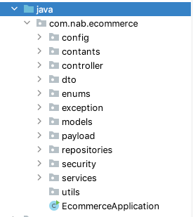

# NAB E-Commerce Doc
NAB Ecommerce Backend APIs

Back-end: https://github.com/DangQuangITus/Ecommerce-Rest-API

#### Download resource:
1. ```git clone https://github.com/DangQuangITus/Ecommerce-Rest-API.git```
2. ```cd Ecommerce-Rest-API/```
3. ```git checkout develop```

- This is a Maven Project. Ensure, Maven is installed on your system.
- It is Recommended that you use Linux Based OS.

### Database Design
https://dbdiagram.io/d/60a38f43b29a09603d155dc4

### Basic System Design
https://cloud.smartdraw.com/share.aspx/?pubDocShare=4496FAA86E66F0C49B16702315DD1438C5E

### How to run in local
1. Go to parent folder including pom.xml file
2. Run command line 
   ```mvn clean install -DskipTests && java -jar target/ecommerce-0.0.1-SNAPSHOT.jar --spring.config.location=./conf/application.yml```

### The MEAN Stack
- Knowledge in Core Java 
- Coding skills
- Java Development Kit (JDK)
- IntelliJ IDEA 
- H2 Database
- Spring Boot

### Project Hierarchy


#### config 
Configure Spring security to restrict access to protected resources.
Configure Role-based Authorization to protect resources on the server.

#### controller
REST API for admins and customers

#### dto 
Main business request entity

#### exception
Handle specials exception

#### models
Database entities

#### payload
authen dto, api request - response

#### security
Handle JWT token and Current User

